# Hi, I'm Radia (radiaku) 👋

Golang enthusiast • C# tinkerer • Python enjoyer • Java cheater • Android wannabe  
Based in Indonesia. I build data-heavy backends, CLI tools, and cozy dev environments.

---


### :hammer_and_wrench:  Main tools :
<div>
    
    
</div>

## 🔧 Editor Setups (featured)

- 🟢 **Neovim (Linux/Win)** — my main config  
  → [radiaku/nvim](https://github.com/radiaku/nvim)

- 🍎 **Neovim (macOS-first)** — tailored for mac + window managers (Aerospace/Yabai), ghostty/wezterm, tmux  
  → [radiaku/macnvim](https://github.com/radiaku/macnvim)

- 🟣 **Vim (lightweight)** — when servers don’t have neovim  
  → [radiaku/vimrc](https://github.com/radiaku/vimrc)

> Quick install:
>
> ```bash
> # Neovim (Linux):
> git clone https://github.com/radiaku/nvim ~/.config/nvim
>
> # macOS-first setup:
> git clone https://github.com/radiaku/macnvim ~/.config/nvim
>
> # Vim (lightweight):
> git clone https://github.com/radiaku/vimrc ~/.vimrc_runtime && \
>  printf '%s\n' \
>  'set runtimepath+=~/.vimrc_runtime' \
>  'source ~/.vimrc_runtime/vimrcs/default_config.vim' > ~/.vimrc
> ```
>
> See each repo README for requirements, keymaps, and plugin notes.

---

## 🚀 What I’m into lately

- Go + Postgres for financial/charity workflows (donor–foster, reconciliation, bank transfers)
- Data migration pipelines (Python/pandas) with scrupulous validation
- Terminal life: tmux, ghostty/wezterm, zsh, fzf, ripgrep

---

## 🧰 Tech I use

`go` `lua` `bash` `zsh` `postgresql` `mysql` `node` `react` `tmux` `ghostty/wezterm` `obsidian`

---

## 📊 Public stats

<a href="https://github.com/radiaku">
  
</a>

<a href="https://github.com/radiaku">
  
</a>

## 📊 Private stats



---

## 📌 Selected work

- 🧪 Tooling & configs: [nvim](https://github.com/radiaku/nvim) · [macnvim](https://github.com/radiaku/macnvim) · [vimrc](https://github.com/radiaku/vimrc)
- 🗄️ Data + backend: Postgres CTEs, reconciliation jobs, Excel/CSV ingesters (Python)
- 🛠️ Terminal ergonomics: tmux keymaps, OSC52 clipboard, copy mode workflows

---

## ☕ Reach me

- GitHub: [@radiaku](https://github.com/radiaku)
- (I may be slow to respond.)


### :hammer_and_wrench: Languages and Tools :
<div>
  &nbsp;
  &nbsp;
  &nbsp;
  &nbsp;
  &nbsp;
  &nbsp;
  &nbsp;
  &nbsp;
  &nbsp;
  &nbsp;
  &nbsp;
  &nbsp;
  &nbsp;
  &nbsp;
  &nbsp;
  &nbsp;
  &nbsp;
  &nbsp;
  &nbsp;
  &nbsp;
  &nbsp;
  &nbsp;
  &nbsp;
</div>


